# Projet de Machine Learning : [M2 BIMS] Apprentissage Automatique

Auteur : Noé Méderlet

github : https://github.com/Medernoe/Projet_Machine_Learning

## Introduction
Ce rapport présente l'évaluation et la comparaison de divers algorithmes de classification supervisée (Gaussien, $k$-PPV, fenêtre de Parzen, Perceptron et Bagging) appliqués à trois jeux de données bidimensionnels. L'objectif est d'analyser les performances de chaque modèle à l'aide de matrices de confusion et de taux de bonne classification, tout en optimisant leurs hyperparamètres via validation croisée . L'étude de ces trois jeux de données, présentant des degrés de séparabilité et des topologies différentes, permet d'oberserver théoriquement et empiriquement la robustesse des classifieurs face à la complexité géométrique des frontières de décision.

## 1. Analyses descriptives

Cette analyse exploratoire vise à caractériser la structure géométrique et statistique des trois jeux de données ($\text{TP}_1$, $\text{TP}_2$ et $\text{TP}_3$) dans l'espace bidimensionnel $\mathbb{R}^2$. Chaque jeu de données présente un équilibre parfait des classes avec $5$ groupes distincts et un effectif constant de $N_c = 100$ individus par classe, soit un total de $N = 500$. Les variances empiriques sur chaque axe ($\sigma^2_X, \sigma^2_Y$) et les contours de densité mettent en évidence des propriétés de séparabilité et d'homogénéité très contrastées.

### Jeu de données TP1 : Séparabilité idéale et hétéroscédasticité
Le jeu $\text{TP}_1$ montre des groupes parfaitement isolés dans l'espace, sans aucun chevauchement, ce qui garantit théoriquement un taux de bonne classification proche de $100\%$. 

* **Statistiques :**
  * **Classe 1 :** $N_1 = 100$, $\sigma^2_X \approx 3.33$, $\sigma^2_Y \approx 3.15$
  * **Classe 2 :** $N_2 = 100$, $\sigma^2_X \approx 3.22$, $\sigma^2_Y \approx 2.65$
  * **Classe 3 :** $N_3 = 100$, $\sigma^2_X \approx 3.55$, $\sigma^2_Y \approx 1.30$
  * **Classe 4 :** $N_4 = 100$, $\sigma^2_X \approx 1.31$, $\sigma^2_Y \approx 5.44$
  * **Classe 5 :** $N_5 = 100$, $\sigma^2_X \approx 1.81$, $\sigma^2_Y \approx 1.87$

* **Analyse des élipses et variances :** On observe une hétéroscédasticité. Les classes 1, 2 et 5 présentent un comportement quasi-isotrope ($\sigma^2_X \approx \sigma^2_Y$), générant des contours de densité circulaires. À l'inverse, la classe 3 subit un étirement horizontal marqué ($\sigma^2_X > \sigma^2_Y$), tandis que la classe 4 montre un fort allongement vertical ($\sigma^2_X < \sigma^2_Y$).
* **Hypothèse gaussienne :** Les ellipses de densité semblent validé l'hypothèse de normalité $\mathcal{N}(\mu_c, \Sigma_c)$.

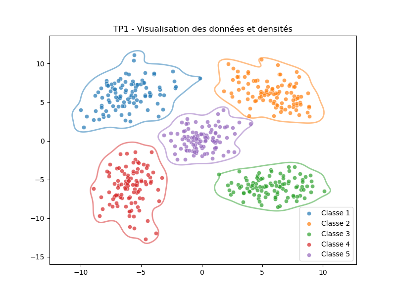

### Jeu de données TP2 : Recouvrement et variabilité intra-classe
Le jeu $\text{TP}_2$ introduit une complexité majeure car les classes ne sont plus linéairement séparables en raison d'un chevauchement, particulièrement au centre de la distribution, sur la classe 3.

* **Statistiques empiriques :**
  * **Classe 1 :** $N_1 = 100$, $\sigma^2_X \approx 5.13$, $\sigma^2_Y \approx 1.00$
  * **Classe 2 :** $N_2 = 100$, $\sigma^2_X \approx 4.34$, $\sigma^2_Y \approx 3.47$
  * **Classe 3 :** $N_3 = 100$, $\sigma^2_X \approx 5.02$, $\sigma^2_Y \approx 4.12$
  * **Classe 4 :** $N_4 = 100$, $\sigma^2_X \approx 4.11$, $\sigma^2_Y \approx 4.78$
  * **Classe 5 :** $N_5 = 100$, $\sigma^2_X \approx 0.86$, $\sigma^2_Y \approx 5.16$

* **Analyse des élipses et variances :** Les variances globales sont nettement plus élevées que dans le $\text{TP}_1$, traduisant une forte dispersion intra-classe. La classe 1 est très aplatie horizontalement ($\sigma^2_X \gg \sigma^2_Y$), alors que la classe 5 est étirée verticalement ($\sigma^2_X \ll \sigma^2_Y$). Les classes centrales (2, 3, 4) possèdent des variances massives sur les deux axes.
* **Hypothèse gaussienne :** Bien que les nuages de points conservent une structure globale elliptique compatible avec un modèle gaussien, la forte intersection des densités va induire un taux d'erreur inévitable sur les zones frontières.

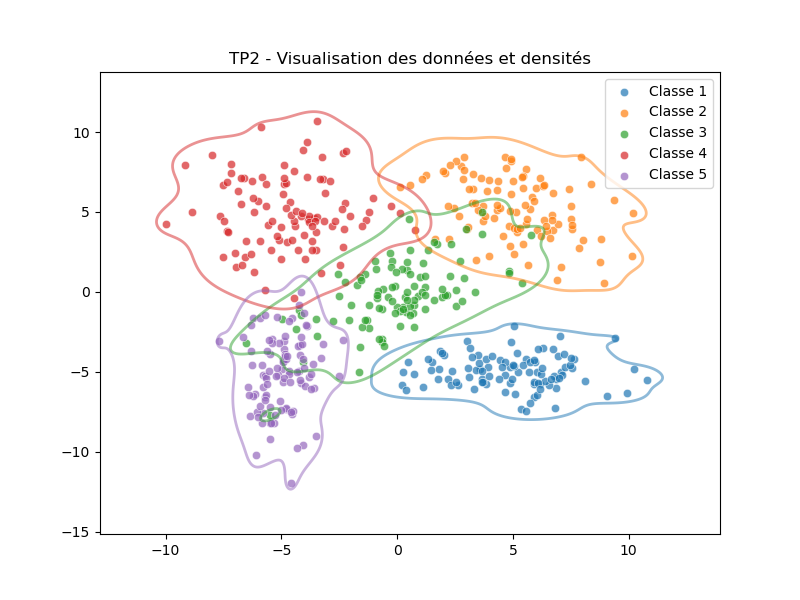

### Jeu de données TP3 : Topologies non-gaussiennes et structures complexes
Le jeu $\text{TP}_3$ ne semble pas suivre l'hypothèse de linéarité et de normalité. Les valeurs de variances masquent ici la véritable géométrie des données.

* **Statistiques empiriques :**
  * **Classe 1 :** $N_1 = 100$, $\sigma^2_X \approx 4.84$, $\sigma^2_Y \approx 5.28$
  * **Classe 2 :** $N_2 = 100$, $\sigma^2_X \approx 3.94$, $\sigma^2_Y \approx 4.27$
  * **Classe 3 :** $N_3 = 100$, $\sigma^2_X \approx 3.67$, $\sigma^2_Y \approx 3.20$
  * **Classe 4 :** $N_4 = 100$, $\sigma^2_X \approx 5.16$, $\sigma^2_Y \approx 1.05$
  * **Classe 5 :** $N_5 = 100$, $\sigma^2_X \approx 0.97$, $\sigma^2_Y \approx 6.05$

* **Analyse des formes et variances :** Les statistiques descriptives affichent des variances importantes (notamment la classe 5 avec $\sigma^2_Y \approx 6.05$ et la classe 4 avec $\sigma^2_X \approx 5.16$). Il est bien plus compliqué d'observer les formes des ellipses et de conclure sur la normalité des données seulement par des observations empiriques. Les données du TP3 risquent d'être difficilement classifiées, surtout avec des modèles linéaires.

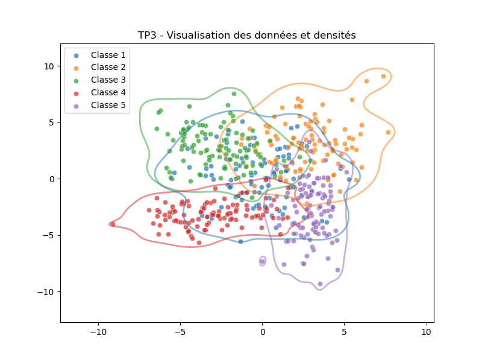

## 2. Estimation de Gaussiennes

L'estimation gaussiennes est une méthode de classification paramétrique qui suppose que les données de chaque classe suivent une loi normale multidimensionnelle (ici bidimensionnelle). La décision repose sur le calcul de la probabilité *a posteriori* via le théorème de Bayes. Dans notre cas, les classes étant équiprobables ($P(\omega_i) = 1/5$), la règle de décision de Bayes se simplifie et revient à maximiser la vraisemblance $p(x|\omega_i)$.

### Fonction de décision et métriques de distance

La fonction de densité de probabilité pour une loi normale multidimensionnelle de dimension $d$ est donnée par :
$$p(x|\omega_i) = \frac{1}{(2\pi)^{d/2} |\Sigma_i|^{1/2}} \exp\left(-\frac{1}{2} (x - \mu_i)^t \Sigma_i^{-1} (x - \mu_i)\right)$$
où $\mu_i$ est le vecteur moyenne (barycentre) et $\Sigma_i$ la matrice de covariance de la classe $\omega_i$.

Pour des raisons pratiques, on manipule souvent le logarithme de cette fonction, conduisant à la fonction de décision $g_i(x)$ :
$$g_i(x) = -\frac{1}{2} (x - \mu_i)^t \Sigma_i^{-1} (x - \mu_i) - \frac{1}{2} \ln |\Sigma_i| + \ln P(\omega_i)$$

En ignorant les termes constants et en multipliant par $-2$, minimiser $-2 g_i(x)$ revient à chercher la classe minimisant une mesure de « distance ». Selon les hypothèses faites sur la matrice de covariance $\Sigma_i$, trois métriques de décision émergent :

1. **Distance Euclidienne :** Si l'on suppose que les variables sont indépendantes et de même variance (matrice de covariance proportionnelle à l'identité $\Sigma_i = \sigma^2 I$), la décision se réduit au calcul de la distance euclidienne par rapport au centre de gravité $\mu_i$.
   $$D_{eucl}(x, \mu_i) = \sqrt{\sum_{j=1}^{d} (x_j - \mu_{ij})^2}$$
   *Utilisation :* Idéale pour des classes sphériques (isotropes) de même taille.

2. **Distance de Mahalanobis :** Si l'on suppose que toutes les classes partagent la même matrice de covariance ($\Sigma_i = \Sigma$), le terme $\ln |\Sigma_i|$ devient constant et s'annule. La décision repose alors sur la distance de Mahalanobis, qui prend en compte les corrélations entre variables.
   $$D_{mahal}^2(x, \mu_i) = (x - \mu_i)^t \Sigma^{-1} (x - \mu_i)$$
   *Utilisation :* Adaptée lorsque les classes ont des formes elliptiques similaires et orientées dans la même direction.

3. **Log-Vraisemblance (Cas général) :** Si chaque classe possède sa propre matrice de covariance $\Sigma_i$, on utilise la forme complète. Dans le code, elle s'exprime comme une distance de Mahalanobis modifiée (pénalisée par le déterminant de la matrice de covariance de la classe) :
   $$D_{logV}(x, \mu_i) = (x - \mu_i)^t \Sigma_i^{-1} (x - \mu_i) + \ln |\Sigma_i|$$
   *Utilisation :* Requise lorsque les classes ont des formes et des orientations différentes (hétéroscédasticité).

### Évaluation sur les jeux de données

#### Évaluation sur le jeu de données TP1 

Le jeu de données TP1 est caractérisé par des classes parfaitement séparées (aucun chevauchement) mais hétéroscédastiques, c'est-à-dire que chaque classe possède sa propre structure de covariance (notamment les classes 3 et 4 qui sont fortement étirées).

Les performances globales (taux de bonne classification) reflètent la  séparabilité des données, avec des scores excellents pour les trois métriques :
* **Distance Euclidienne :** $99.2\%$
* **Distance de Mahalanobis :** $99.6\%$
* **Log-Vraisemblance :** $99.6\%$

Cependant, l'analyse géométrique des frontières de décision révèle le comportement distinct de chaque métriques de décisions.

##### 1. Distance Euclidienne 
La distance euclidienne génère des frontières de décision linéaires. Bien que le score soit de $99.2\%$, l'algorithme ignore l'étirement des classes. Les rares erreurs (visibles sur la matrice de confusion) se produisent aux extrémités des classes étirées, où un point éloigné du centre de sa propre classe se retrouve géométriquement plus proche du centre d'une classe voisine.

| Frontière de décision Euclidienne | Matrice de confusion Euclidienne |
| :---: | :---: |
|  |  |

##### 2. Distance de Mahalanobis ($\Sigma_i = \Sigma$)
Les frontières de décision ne sont plus linéaires, mais sont désormais orientées et ajustées prennant en compte l'allongement des classes du jeu de données (covariance). Le modèle gagne légèrement en précision ($99.6\%$), corrigeant certaines erreurs.

| Frontière de décision Mahalanobis | Matrice de confusion Mahalanobis |
| :---: | :---: |
| 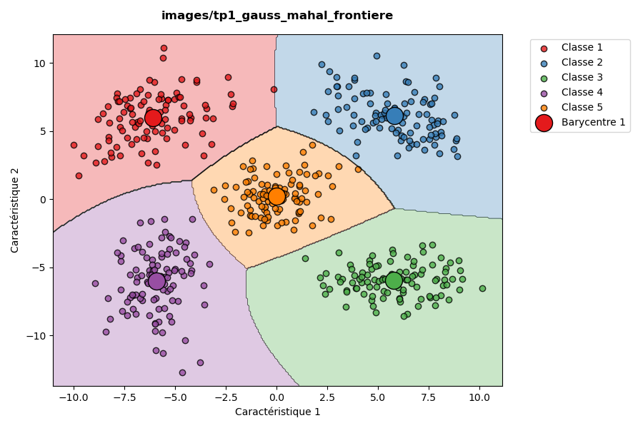 | 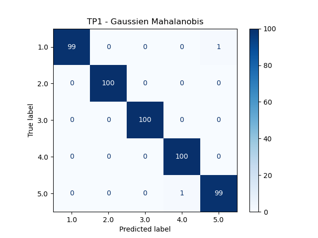 |

##### 3. Log-Vraisemblance (Covariances distinctes $\Sigma_i$)
Bien qu'il s'agisse du modèle théoriquement parfait pour ce TP, il obtient un score de $99.6\%$ (identique à mahalanobis) et génère des frontières de décision identiques à celles estimées avec la distance de Mahalanobis. Par conséquent, les classifications sont identiques. Empiriquement, l'utilisation de cette métrique n'a donc apporté aucune amélioration par rapport à la méthode précédente.

| Frontière de décision Log-Vraisemblance | Matrice de confusion Log-Vraisemblance |
| :---: | :---: |
| 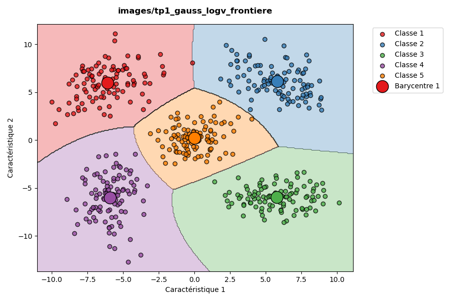 |  |

**Conclusion TP1 :** La grande distance inter-classes permet à des modèles simples (Euclidien) de très bien performer. Néanmoins, l'observation des frontières de décision démontre que la distance de Mahalanobis et la Log-Vraisemblance sont les seul modèle capturant la véritable topologie (hétéroscédasticité) des données.

---

#### Évaluation sur le jeu de données TP2

Comme anticipé lors de l'analyse descriptive, le jeu de données TP2 présente une complexité supérieure due à un fort chevauchement des classes au centre de l'espace. Cette imbrication rend une séparation parfaite impossible, ce qui se traduit par une baisse logique des performances globales par rapport au TP1.

Les taux de bonne classification observés sont les suivants :
* **Distance Euclidienne :** $94.6\%$
* **Distance de Mahalanobis :** $95.4\%$
* **Log-Vraisemblance :** $94.6\%$

Paradoxalement, ce n'est pas le modèle le plus complexe (Log-Vraisemblance) qui obtient le meilleur score, mais le modèle intermédiaire (Mahalanobis). L'analyse des frontières permet d'expliquer ce phénomène empirique.

##### 1. Distance Euclidienne 
Les frontières sont linéaires et l'algorithme suppose des classes circulaires isotropes. Sur la matrice de confusion, on constate que les erreurs se concentrent massivement entre les classes centrales fortement imbriquées. L'incapacité du modèle à s'adapter à l'étirement des données limite ses performances à $94.6\%$.

| Frontière de décision Euclidienne | Matrice de confusion Euclidienne |
| :---: | :---: |
| 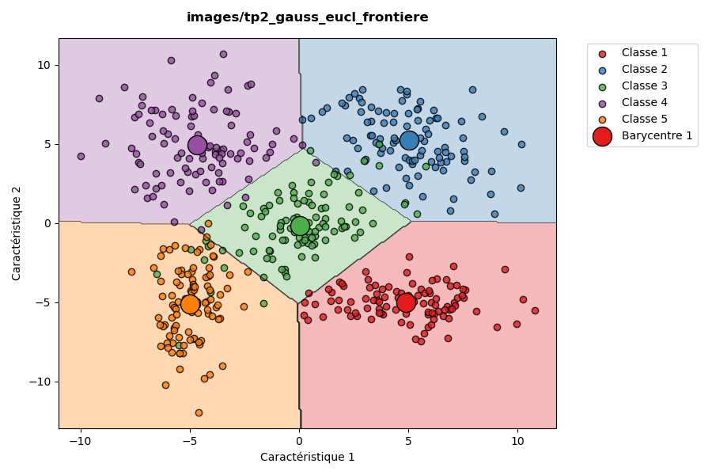 | 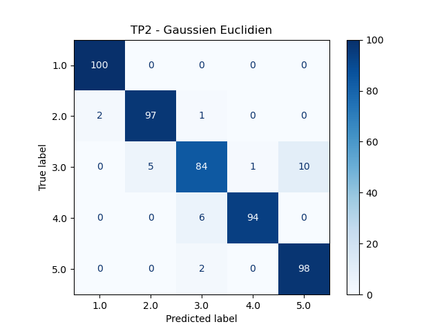 |

##### 2. Distance de Mahalanobis ($\Sigma_i = \Sigma$)
Dans ce cas, les meilleures performances sont obtenues avec cette métrique, les frontières s'orientent différemment et épousent bien mieux la topologie des classes. Toutefois, en raison d'une variance très élevée dans la classe 3, une zone géométriquement plus proche du barycentre de la classe 5 (en distance euclidienne) se retrouve assignée à la classe 3 (zone verte au bord gauche). Bien que cette déformation de la frontière puisse s'apparenter à un surapprentissage sur les données, l'absence de points de test dans cette zone spécifique évite de pénaliser ou validé le modèle. Au final, c'est cette capacité d'adaptation globale aux variances des distributions qui lui permet de mieux généraliser et d'obtenir le meilleur score ($95.4\%$).

| Frontière de décision Mahalanobis | Matrice de confusion Mahalanobis |
| :---: | :---: |
|  |  |

##### 3. Log-Vraisemblance (Covariances distinctes $\Sigma_i$)
Bien que la Log-Vraisemblance trace des frontières capables de mieux isoler la classe 1 (horizontale) et la classe 5 (verticale), ce degré de liberté supplémentaire la dessert dans la zone de fort chevauchement central, en effet il est possible d'observer de très légère différences avec les délimitations obtenue via mahalanobis. Les frontières courbées ont tendances à trop coller à la distribution de la base d'apprentissage (sur apprentissage). De plus, on observe le meme sur apprentissage avec la zone verte très éloigné du baricentre 3. 

| Frontière de décision Log-Vraisemblance | Matrice de confusion Log-Vraisemblance |
| :---: | :---: |
| 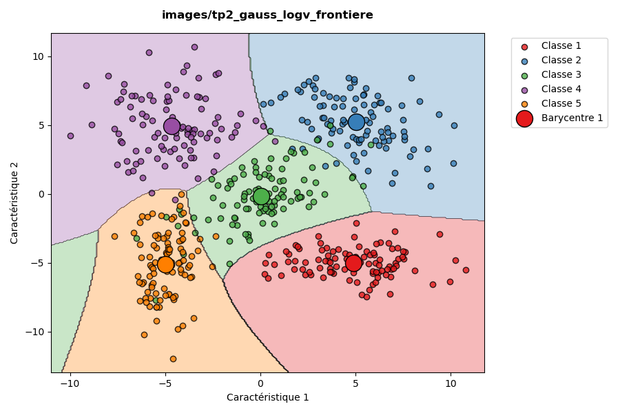 |  |

**Conclusion TP2 :** Ce jeu de données illustre un principe fondamental du Machine Learning, face à des données bruitées et se chevauchant fortement, un modèle plus complexe (Log-Vraisemblance) n'est pas toujours le plus performant. Un modèle plus contraint (Mahalanobis) peut offrir de meilleurs résultats tout en nécessitant des ressources computationnelles moindres.

---

#### Évaluation sur le jeu de données TP3

Le jeu de données TP3 met en évidences une des limites des modèles paramétriques. Comme observé lors de l'analyse descriptive, les classes présentent des topologies complexes qui ne semblent pas suivre une hypothèse de distribution normale sous-jacente à ces algorithmes.

En conséquence, les performances diminuent de manière significative par rapport aux jeux de données précédents :
* **Distance Euclidienne :** $72.8\%$
* **Distance de Mahalanobis :** $69.4\%$
* **Log-Vraisemblance :** $69.8\%$

Ici, aucun des modèles gaussiens ne parvient à modéliser correctement la réalité géométrique des données.

##### 1. Distance Euclidienne 
Bien qu'il s'agisse du modèle le plus simple, il obtient le meilleur score ($72.8\%$). En découpant l'espace de manière strictement linéaire à partir des centres de gravité, il parvient à isoler grossièrement certaines masses de points. Cependant, face à des classes qui s'encerclent, la séparation linéaire coupe arbitrairement les distributions en deux, générant de lourdes erreurs visibles sur la matrice de confusion. Il est notamment difficile pour le modèle de classer les points de la classe 1, comme observé sur le graphique de la frontière de décision, ces derniers ont tendance à se retrouver dans les zones de décision attribuées aux autres classes (d'où le grand nombre d'erreurs pour la classe 1 dans la matrice de confusion).

| Frontière de décision Euclidienne | Matrice de confusion Euclidienne |
| :---: | :---: |
| 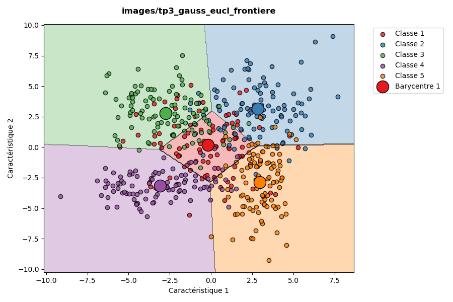 | 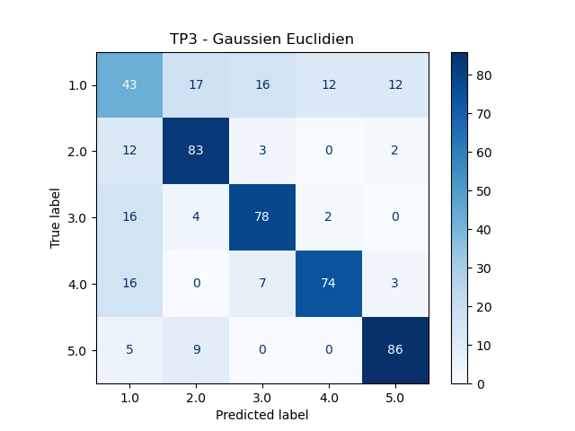 |

##### 2. Distance de Mahalanobis ($\Sigma_i = \Sigma$)
L'algorithme déforme l'espace de manière inappropriée pour tenter de trouver un compromis. Le score chute à $69.4\%$ et les frontières de décision s'avèrent totalement inadaptées à la forme des nuages de points. On observe notamment de nombreux points de la classe 1 situés dans les régions de décision des autres classes, ainsi qu'une zone de surapprentissage pour cette même classe 1 en raison de sa forte variance.

| Frontière de décision Mahalanobis | Matrice de confusion Mahalanobis |
| :---: | :---: |
| 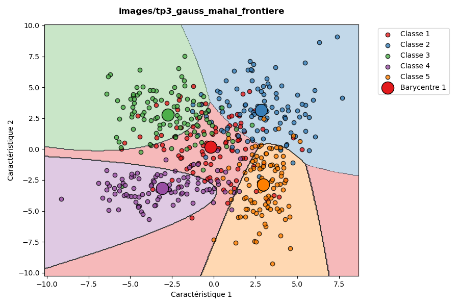 | 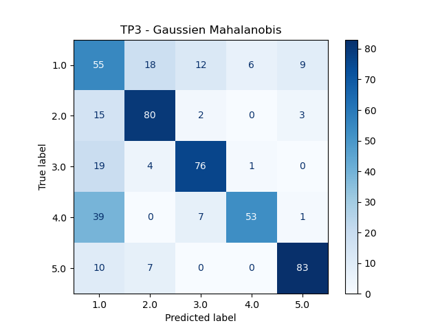 |

##### 3. Log-Vraisemblance (Covariances distinctes $\Sigma_i$)
La forme globale des zones de décision reste similaire à celles obtenues avec la distance de Mahalanobis. Cependant, on observe une meilleure adaptation à la topologie des données, avec un étirement des frontières plus ou moins marqué selon les classes. Si cette flexibilité permet d'obtenir un score très légèrement supérieur ($69.8\%$), l'écart ne semble pas significatif. On peut d'ailleurs supposer qu'avec un jeu d'apprentissage différent, les performances de ce modèle pourraient s'avérer plus faibles que celles obtenues avec Mahalanobis.

| Frontière de décision Log-Vraisemblance | Matrice de confusion Log-Vraisemblance |
| :---: | :---: |
| 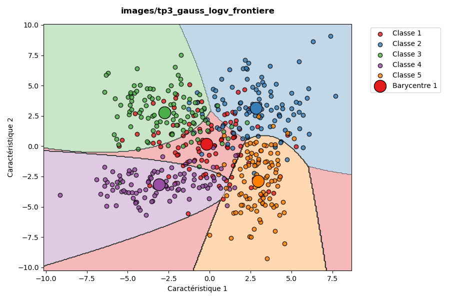 | 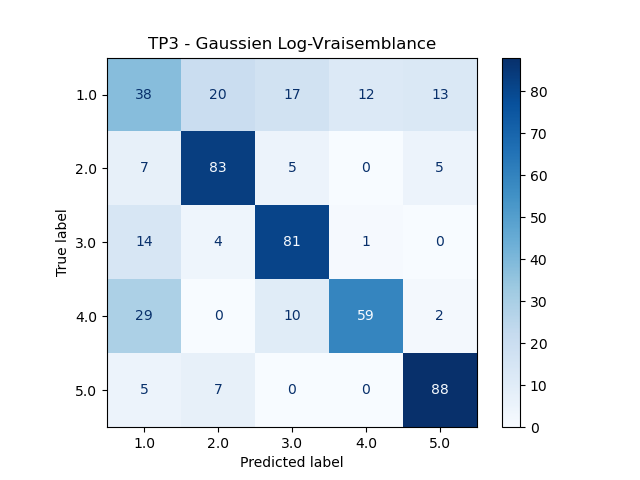 |

### Conclusion sur l'Estimation de Gaussiennes
L'étude croisée sur ces trois jeux de données démontre que l'estimation  gaussiennes est extrêmement puissante lorsque l'hypothèse de normalité est respectée (TP1), et qu'un modèle avec covariance globale (Mahalanobis) est plus adapté en cas de chevauchement (TP2), il est également important de noté que la distance euclidienne, bien que tracant des frontière linéaire à souvent produit de très bon résultats proche de mahalnobis. Cependant, face à des distributions plus complexe (TP3), ces méthodes paramétriques sont limitées, justifiant le recours à des approches non-paramétriques explorées dans la suite de ce rapport.

## 3. Algorithme des k Plus Proches Voisins (k-PPV)

L'algorithme des $k$-PPV est une méthode de classification non-paramétrique qui ne fait aucune hypothèse sur la distribution des données. Au lieu de pré-calculer un modèle global (comme les barycentres gaussiens), la décision est prise localement. Pour classer un nouvel individu, on identifie ses $k$ voisins les plus proches dans l'ensemble d'apprentissage (via la distance euclidienne) et on observe leurs étiquettes. Pour maximiser la généralisation, le choix de l'hyperparamètre $k$ a été optimisé par validation croisée à 5 blocs (5-CV). 

Deux stratégies de décision ont été comparées :
* **Vote à la majorité :** La classe la plus fréquente parmi les $k$ voisins est assignée à l'individu.
* **Vote à l'unanimité (ou impartial) :** Exige un consensus (tous les voisins doivent appartenir à la même classe). Dans le cas contraire, le point est rejeté (classe -1).

### Évaluation sur le jeu de données TP1
Grâce à la forte séparabilité des classes, le modèle $1$-PPV offre déjà d'excellents résultats avec une précision de **99.2%**. La validation croisée a déterminé que **$k=5$** était l'hyperparamètre optimal.

* En utilisant le **5-PPV Majorité**, on lisse les légères incertitudes aux frontières, ce qui permet d'atteindre une précision quasi parfaite de **99.6%**. 
* En revanche, le **5-PPV Unanimité** fait légèrement chuter le score (**98.4%**). Bien que les classes soient éloignées, quelques points situés à l'extrême périphérie de leur distribution captent un voisin d'une autre classe, brisant ainsi l'unanimité requise.

| 1-PPV | 5-PPV Majorité | 5-PPV Unanimité |
| :---: | :---: | :---: |
| 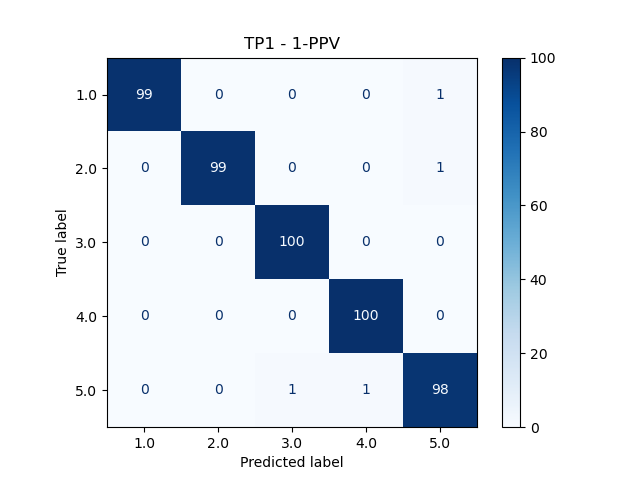 |  | 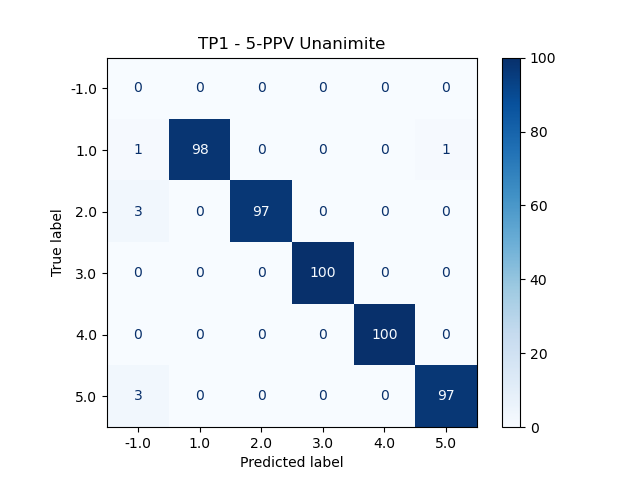 |

---

### Évaluation sur le jeu de données TP2
Ce jeu de données présente un fort chevauchement central. Le modèle $1$-PPV atteint **92%**, mais a tendance à surapprendre en créant des îlots isolés autour de points. La 5-CV a sélectionné un voisinage beaucoup plus large : **$k=11$**.

* Le **11-PPV Majorité** améliore significativement le score (**94.8%**). Le fait de consulter 11 voisins agit comme un filtre, il lisse les frontières de décision complexes au centre du nuage de points et ignore le bruit.
* Le **11-PPV Unanimité** diminue à **68.4%**. Dans les zones de fort chevauchement (classes 2, 3 et 4), il est géométriquement impossible de trouver 11 voisins consécutifs appartenant à la même classe. L'algorithme se retrouve bloqué par l'indécision, cependant la robustesse du 11-PPV réside dans sa capacité à etre sur de la classe des points dans presque **~70%** et d'assurer un rejet robuste dans **~30%** des cas.

| 1-PPV | 11-PPV Majorité | 11-PPV Unanimité |
| :---: | :---: | :---: |
|  |  | 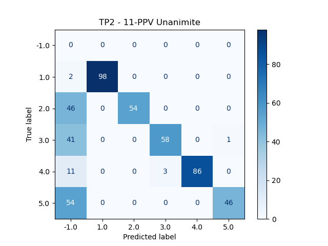 |

---

### Évaluation sur le jeu de données TP3
Le TP3 est caractérisé par des formes géométriques complexes (fort  emboîtements). Là où les modèles gaussiens stricts échouaient autour de 69-72%, on aurait pu espérer que la nature non-paramétrique du $k$-PPV améliore les prédictions. 

La 5-CV a déterminé un optimum de **$k=9$**.
* Le **1-PPV** n'obtient que **64.6%**, l'espace étant trop bruité.
* Le **9-PPV Majorité** remonte le score à **69.6%**. Bien que l'algorithme s'adapte théoriquement mieux aux topologies non-elliptiques, l'imbrication des données est telle que les voisinages locaux restent très hétérogènes.
* Le **9-PPV Unanimité** voit sa précision chuter à **24.2%**. Les structures des classes garantissent la présence de multiples classes dans presque n'importe quelle fenêtre de 9 voisins.

| 1-PPV | 9-PPV Majorité | 9-PPV Unanimité |
| :---: | :---: | :---: |
| 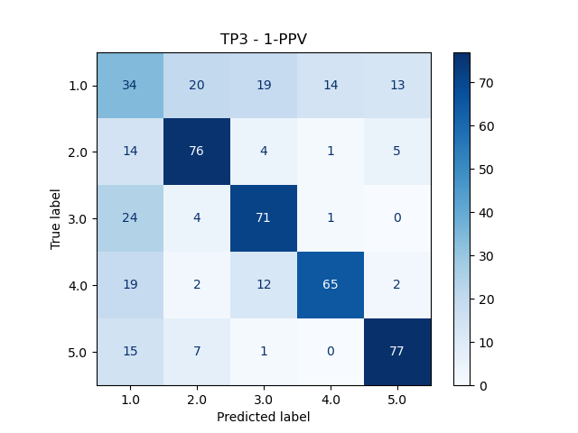 |  | 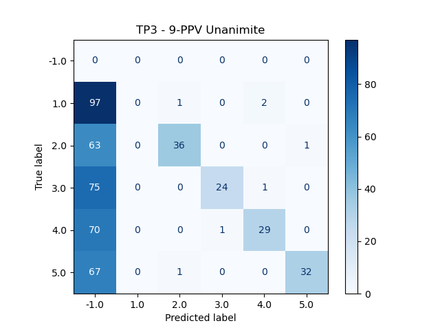 |

### Conclusion sur le k-PPV
L'algorithme $k$-PPV est très intuitif et efficace lorsque le paramètre $k$ est bien calibré par validation croisée. Le vote à la majorité permet de créer des frontières lisses et robustes au bruit. En revanche, le vote à l'unanimité s'avère très punitif et inadapté dès lors que les données présentent le moindre chevauchement ou bruit local. Néanmoins, l'exigence d'unanimité garantit des prédictions avec un très haut niveau de confiance (lorsqu'un point est classé), et ce de manière d'autant plus marquée que $k$ est grand.

## 4. Fenêtres de Parzen

La méthode des fenêtres de Parzen est une approche non paramétrique d'estimation de densité de probabilité ($p(x|\omega_i)$). Contrairement à l'estimation gaussiennes, elle ne suppose aucune forme analytique pour les distributions. Au lieu de cela, elle estime la densité en plaçant une fonction noyau $K$ et en sommant les contributions de tous les points à proximité d'un nouveau point $x$.

### Théorie et principe

L'estimateur de Parzen en dimension $d$ est défini par :
$$\hat{p}(x) = \frac{1}{N h^d} \sum_{i=1}^{N} K\left(\frac{x - x_i}{h}\right)$$
où $h$ est le paramètre de lissage (fenêtre) et $K$ est le noyau (ex: uniforme ou gaussien). 

Le choix de **$h$** est critique :
* Si $h$ est trop petit : L'estimation est très bruitée (surapprentissage).
* Si $h$ est trop grand : L'estimation est trop lisse (sous-apprentissage, perte de détails).

### Analyse des résultats

Les noyaux évalués sont **uniforme** et **gaussien**, avec optimisation de $h$ par 5-CV.

#### Jeu de données TP1 
La méthode est robuste ici car elle n'a aucun mal à isoler les classes distinctes.
* **Accuracy :** Les deux noyaux atteignent des scores de **99.2%**. La précision est excellente, bien que légèrement inférieure aux meilleurs modèles gaussiens.
* **Observation :** Les matrices de confusion ne montrent quasiment aucune erreur, validant la capacité du noyau à représenter les densités locales.

| Parzen Uniforme (TP1) | Parzen Gaussien (TP1) |
| :---: | :---: |
|  | 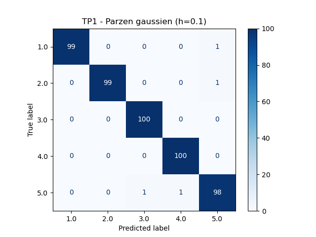 |

--- 

#### Jeu de données TP2 
Dans cet environnement plus complexe, Parzen reste très performant par rapport aux approches paramétriques .
* **Accuracy :** Le noyau uniforme ($h=3.0$) obtient **94.6%** et le gaussien ($h=1.0$) obtient **94.8%**.
* **Observation :** Les deux noyaux offrent des performances très comparables aux meilleurs modèles gaussiens (Mahalanobis). La flexibilité de Parzen lui permet de capturer les formes complexes tout en limitant les erreurs dans les zones de chevauchement central.

| Parzen Uniforme (TP2) | Parzen Gaussien (TP2) |
| :---: | :---: |
|  |  |

--- 

#### Jeu de données TP3
Parzen surpasse les classifieurs gaussiens (qui plafonnaient à ~70% et présentaient de possible sur apprentissage).
* **Accuracy :** Le noyau uniforme ($h=2.0$) obtient **70.0%** et le gaussien ($h=1.5$) obtient **72.6%**.
* **Observation :** L'approche non paramétrique épouse bien mieux les formes non convexes et les chevauchements que les modèles gaussiens. Parzen parvient à mieux définir les frontières.

|Frontière de décision Parzen Uniforme (TP3) |Frontière de décision  Parzen Gaussien (TP3) |
| :---: | :---: |
| 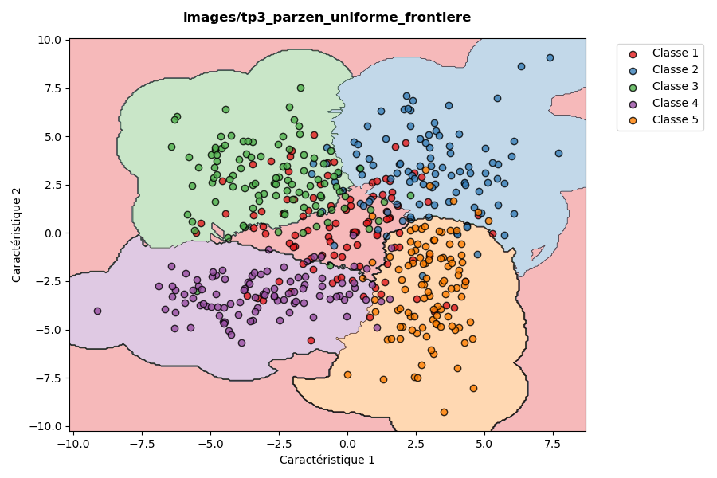  | 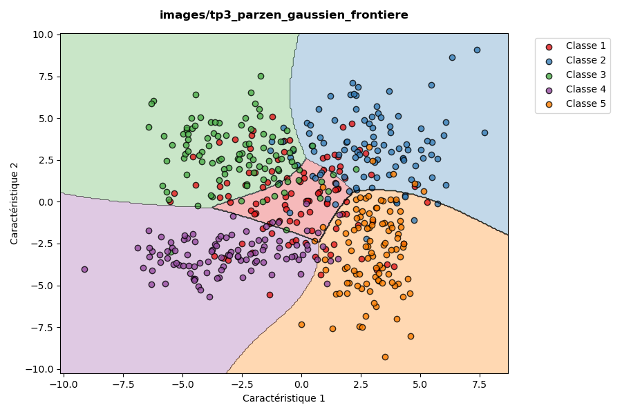 |

| Parzen Uniforme (TP3) | Parzen Gaussien (TP3) |
| :---: | :---: |
| 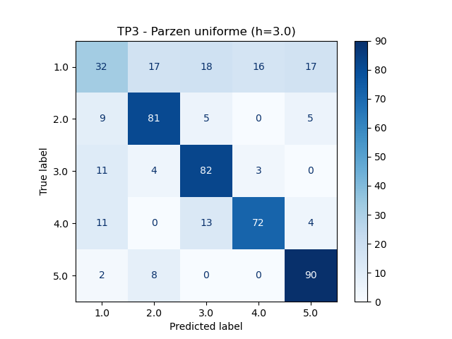 |  |

### Conclusion sur Parzen
La fenêtre de Parzen est un classifieur très puissant. Son avantage majeur est de n'avoir aucun apprioris quand à la forme et la distribution des données, ce qui en fait un meilleur choix que les modèles gaussiens pour les cas complexes (TP3). Toutefois, son coût calculatoire est plus élevé lors de la phase de prédiction, car il nécessite de parcourir l'ensemble de la base d'apprentissage pour chaque nouveau point.

## 5. Perceptron : Séparation Linéaire

Le Perceptron est un modèle de classification linéaire paramétrique. Son principe repose sur la recherche d'un hyperplan séparateur défini par un vecteur de poids $W$ et un biais $a_0$. Pour un point $x \in \mathbb{R}^d$, la décision est prise selon le signe de $f(x) = W^t x + a_0$.

Pour simplifier l'apprentissage, les données ont subies une transformation de l'espace en passant dans $\mathbb{R}^{d+1}$ afin d'intégrer le biais directement dans le vecteur de poids $W = (w_1, \dots, w_d, a_0)$ et une seconde en transformant les points de la classe négative $x_2$ en leur opposé, $y_2 = (-x, -1)$. Ainsi, le problème devient la recherche d'un vecteur $W$ tel que, pour tout point $y$ du jeu de données, nous ayons $W^t y > 0$.

### Stratégies de classification multi-classes
* **One-vs-One (OvO) :** On entraîne un classifieur pour chaque paire de classes (pour 5 classes : $5 \times 4 / 2 = 10$ hyperplans). La classe finale est déterminée par un vote majoritaire.
* **One-vs-All (OvA) :** On entraîne un classifieur par classe, visant à séparer cette classe de toutes les autres (pour 4 classes : 4 hyperplans).

Contrairement à une approche qui forcerait systématiquement une décision, règle de décision géométrique est appliquée. Si un point se trouve dans une zone ambiguë, c'est-à-dire si reconnues comme appartenant à plusieurs classes avec une égalité parfaite, ou si aucune classe n'est reconnue ($W^t y < 0$). Il est alors assigné à une zone non classable (classe $-1$). Cette approche permet de visualiser les véritables incertitudes géométriques du modèle.

### Analyse des résultats

#### Jeu de données TP1
* **Accuracy :** OvO 5C ($99.2\%$), OvO 4C ($99.75\%$), OvA 4C ($75.75\%$).
* **Observation :** Bien que les classes soient parfaitement disjointes, la méthode OvA subit une chute de performance drastique. La logique d'incertitude stricte révèle ici sa faiblesse, l'espace entre les classes est si vaste que de nombreux points de test tombent dans des zones vides, ces points sont donc rejetés ($-1$). L'approche OvO, en quadrillant l'espace par paires, encadre beaucoup mieux les données et évite ces zones de doute.

**Frontière de décision (OvA 4C) :**
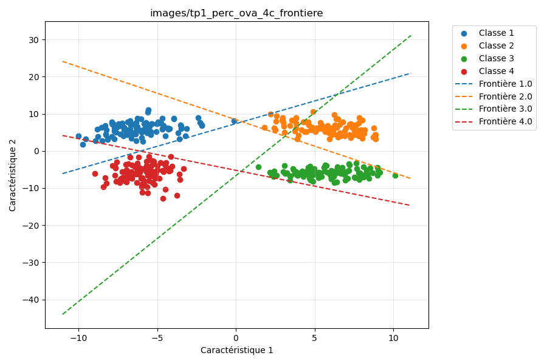

| Perceptron OvO 5C | Perceptron OvO 4C | Perceptron OvA 4C |
| :---: | :---: | :---: |
| 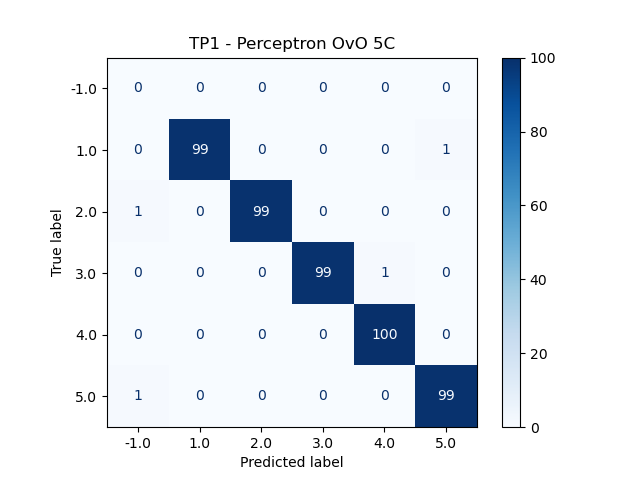 | 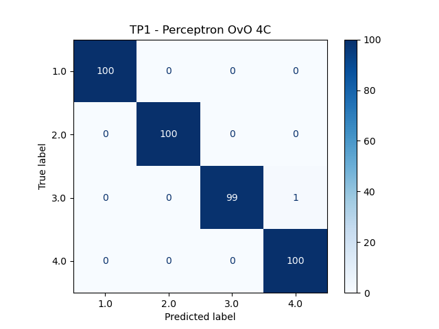 | 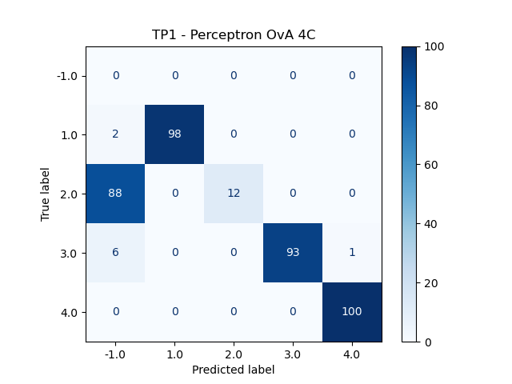 |

---

#### Jeu de données TP2
* **Accuracy :** OvO 5C ($74.6\%$), OvO 4C ($98.75\%$), OvA 4C ($45.0\%$).
* **Observation :** La méthode OvA s'effondre sous la barre des 50 % car l'imbrication des données rend impossible l'isolement d'une classe sans traverser les autres. Le centre du graphique devient une immense zone de conflit où plusieurs perceptrons s'activent simultanément, entraînant un rejet massif des points centraux. L'approche OvO 5C résiste mieux ($74.6\%$) en simplifiant les séparations, mais subit la limite de la linéarité. Comme pour OvA, avec 5 classes le problème n'est pas linéairement séparable, les poids ne sont pas les optimaux d'une solution, mais les meilleurs poids trouvés après un maximum d'itération fixé à 1000. Comme l'on peut le voir avec la droite orange, elle coupe la classe 2 sans la séparer d'aucune autre classe. 
Lorsque l'on retire la classe centrale (OvO 4C), le score augmente à $98.75\%$. Cela montre que la complexité de ce jeu de données était presque exclusivement causée par l'imbrication de cette classe centrale avec les classes périphériques.

**Frontière de décision (OvA 4C) :**
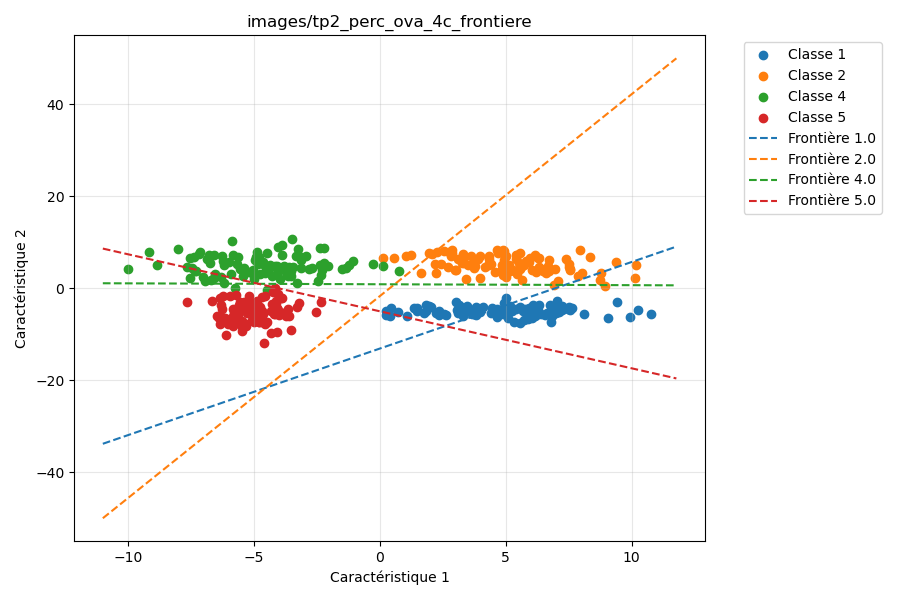

| Perceptron OvO 5C | Perceptron OvO 4C | Perceptron OvA 4C |
| :---: | :---: | :---: |
| 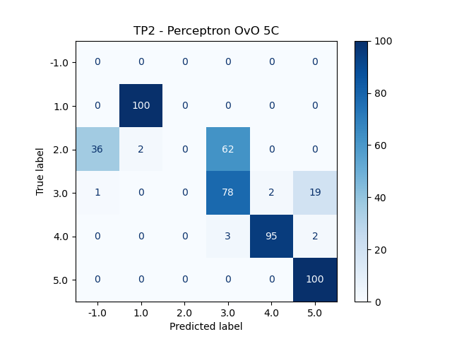 | 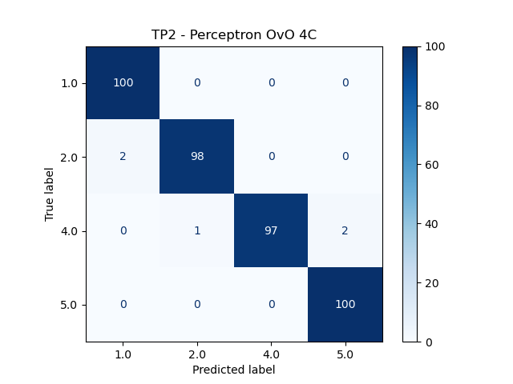 | 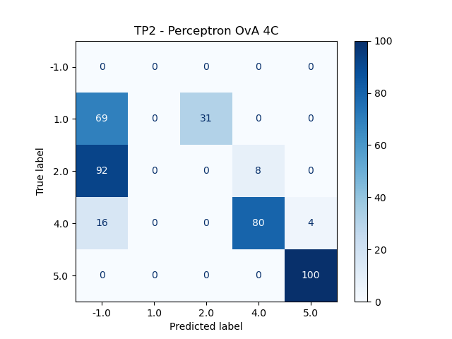 |

---

#### Jeu de données TP3
* **Accuracy :** OvO 5C ($52.2\%$), OvO 4C ($65.75\%$), OvA 4C ($37.0\%$).
* **Observation :** Sur ces structures complexes et emboîtées, les droites traversent les classes de part en part. La méthode OvA illustre un échec géométrique total avec un score de $37.0\%$. Aucune droite ne pouvant refermer l'espace pour isoler une classe, le modèle génère des intersections chaotiques et rejette une bonne partie des points. L'approche OvO s'en sort à peine mieux, même en retirant la classe centrale (OvO 4C ne remonte qu'à $65.75\%$), car le problème reste non linéaire.

**Frontière de décision (OvA 4C) :**
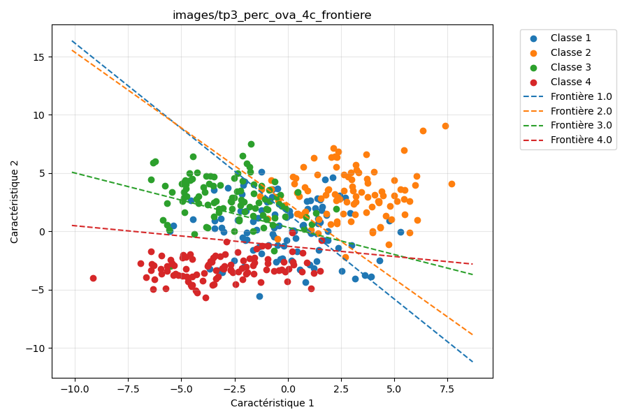

| Perceptron OvO 5C | Perceptron OvO 4C | Perceptron OvA 4C |
| :---: | :---: | :---: |
| 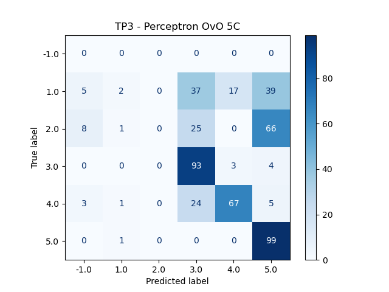 | 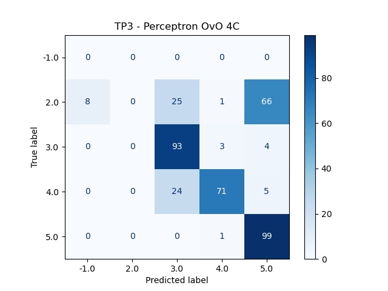 | 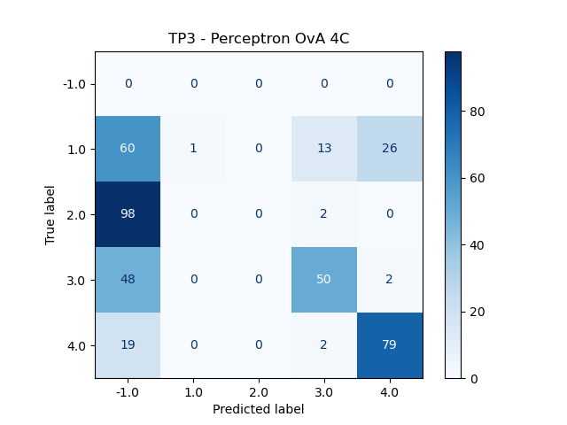 |

---

### Conclusion sur le Perceptron et la théorie de la décision
L'introduction d'une classe de rejet ($-1$) modifie profondément l'évaluation du modèle et illustre parfaitement la théorie de la décision avec coût. Dans de nombreux cas concrets, le coût associé à une erreur de classification (faux positif) est bien plus pénalisant que le coût d'une indécision. Permettre au classifieur d'assumer son doute et de rejeter un point ambigu est donc une propriété analytique précieuse, que l'on ne retrouve qu'avec un perceptron ou un Kppv.

Cependant, cette expérience met en évidence une limite du Perceptron, il applique une frontière géométrique basée uniquement sur le signe d'une équation, sans jamais quantifier son niveau de certitude. Contrairement aux classifieurs statistiques (comme l'estimation gaussiennes) qui calculent une véritable probabilité *a posteriori* $p(\omega_i|x)$ pour évaluer la fiabilité d'une prédiction, le Perceptron ne nuance pas ses décisions. Cette absence de pondération probabiliste le rend particulièrement vulnérable dans les zones de transition et génère des rejets massifs dès que la topologie des données se complexifie.

## 6. Méthodes d'Ensemble : Bagging (Bootstrap Aggregating)

Le Bagging (Bootstrap Aggregating) est une méthode d'apprentissage d'ensemble conçue pour améliorer la précision et la stabilité des algorithmes en réduisant leur variance et en évitant le surapprentissage. 

### Théorie et principe
L'efficacité du Bagging repose sur la combinaison de multiples modèles de base, et s'avère particulièrement pertinente sur des classifieurs dits instables (c'est-à-dire très sensibles aux variations de l'échantillon d'apprentissage, comme les arbres de décision ou le Perceptron). L'algorithme se déroule en deux étapes :
1. **Bootstrap :** Génération de $N$ sous-échantillons d'apprentissage par tirage aléatoire avec remise à partir du jeu de données initial. Un classifieur est entraîné sur chacun de ces sous-échantillons.
2. **Agrégation :** Lors de la prédiction, chaque classifieur émet un vote. La décision finale est prise à la majorité (agrégation des prédictions).

Pour ce projet, le nombre optimal d'estimateurs ($N$) a été déterminé via une validation croisée à 5 blocs (5-CV). Le Bagging a été testé sur deux modèles de base : le Perceptron (pour dépasser ses limites linéaires) et le 1-PPV (pour tenter de stabiliser sa variance locale).

---

### Analyse des résultats : Bagging Perceptron vs Bagging KNN

#### Jeu de données TP1
Sur des données simples, les modèles de base étaient déjà excellents.
* **Bagging Perceptron (N=30) :** $99.4\%$
* **Bagging KNN (N=5) :** $99.4\%$
* **Observation :** Les scores sont quasiment parfaits. Le Bagging n'apporte ici aucune amélioration car la variance initiale des modèles était déjà très faible, les classes étant presque parfaitement séparables. 

| Bagging Perceptron (TP1) | Bagging KNN (TP1) |
| :---: | :---: |
|  |  |

#### Jeu de données TP2 
C'est dans ce scénario bruité que la différence de nature entre les classifieurs se révèle.
* **Bagging Perceptron (N=30) :** $95.6\%$
* **Bagging KNN (N=30) :** $92.0\%$
* **Observation :** L'apport du Bagging sur un classifieur instable comme le Perceptron est flagrant. En agrégeant 30 hyperplans, le modèle parvient à lisser ses frontières de décision globales. Cette combinaison a complètement corrigé le problème des zones non classées (rejetées à $-1$) qui pénalisait le Perceptron simple. À l'inverse, l'apport sur le 1-PPV est bien moins impressionnant. Bien que le 1-PPV présente une forte variance locale, sa logique de décision reste très déterministe sur le jeu de données, le vote majoritaire sur des voisinages bruités a tendance à moyenner les erreurs sans véritablement les résoudre.

| Bagging Perceptron (TP2) | Bagging KNN (TP2) |
| :---: | :---: |
| 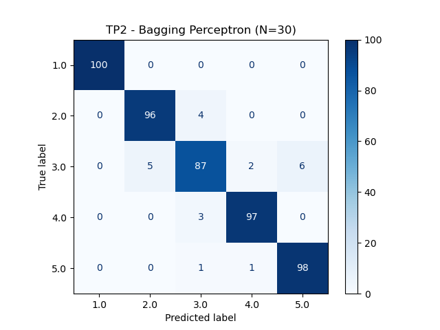 |  |

#### Jeu de données TP3 
Ce jeu de données met à l'épreuve la capacité du Bagging à transformer un classifieur linéaire faible en un modèle complexe.
* **Bagging Perceptron (N=30) :** $71.0\%$
* **Bagging KNN (N=10) :** $65.4\%$
* **Observation :** C'est le résultat le plus spectaculaire. Le Perceptron simple était en échec total sur ce TP, rejetant la grande majorité des points. En appliquant un Bagging de 30 perceptrons, le score passe à **$71.0\%$**. La superposition d'hyperplans linéaires permet de générer des frontières de décision "pseudo-non-linéaires". Il s'agit du seul jeu de données où le Bagging de Perceptron prédit encore quelques points non classés (2 rejets), montrant la capacité du bagging à ne pas être limité par des zones d'incésisons. Le Bagging de 1-PPV, quant à lui, peine toujours à généraliser dans ces zones entremêlées. 

| Bagging Perceptron (TP3) | Bagging KNN (TP3) |
| :---: | :---: |
| 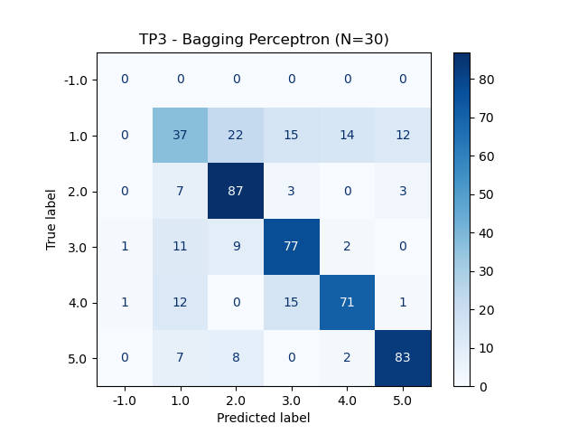 |  |

---

### Conclusion sur le Bagging
Cette étude comparative met en évidence que le Bagging est avant tout redoutable lorsqu'il est appliqué à des modèles instables. La combinaison de multiples frontières linéaires a permis au Perceptron de modéliser des topologies non linéaires (TP3), de filtrer efficacement le bruit (TP2), et surtout d'éliminer ses zones d'indécision géométrique. 

En revanche, l'application du Bagging à un algorithme comme le 1-PPV, dont la variance est purement locale, n'apporte que des gains limités face à des données fortement imbriquées. Toutefois, une perspective d'amélioration très pertinente consisterait à appliquer le Bagging sur un classifieur $k$-PPV (avec un $k$ plus élevé) paramétré avec un vote à l'unanimité. Bien que la contrainte d'unanimité isole de nombreux points (zone de rejet), la combinaison de cette exigence stricte avec l'agrégation de multiples sous-échantillons permettrait d'obtenir un modèle de classification extrêmement robuste, garantissant un niveau de certitude maximal sur les prédictions validées.

## Conclusion 

L'étude comparative de ces divers classifieurs sur trois topologies de données distinctes illustre parfaitement un principe fondamental de l'apprentissage automatique, il n'existe pas d'algorithme « universel ». Le choix du modèle doit impérativement être dicté par la nature géométrique et la distribution statistique des données.

* **Lorsque l'hypothèse de normalité est respectée et les classes bien disjointes (TP1) :** Les méthodes paramétriques simples et rapides ( Classifier Gaussien Euclidien ou le Perceptron) sont amplement suffisantes. Elles offrent d'excellentes performances pour un coût calculatoire minimal.
* **En présence de bruit et d'un fort chevauchement (TP2) :** Les modèles rigides montrent leurs limites. Les méthodes capables de s'adapter à la variance directionnelle (Mahalanobis) ou d'appliquer un lissage spatial local ($k$-PPV avec vote majoritaire) deviennent alors les clés de la résolution du problème, car elles limitent le surapprentissage dans les zones d'incertitude.
* **Face à des géométries complexes et non convexes (TP3) :** Les approches paramétriques linéaires s'effondrent totalement. Il faut alors recourir à des méthodes non paramétriques (Fenêtres de Parzen) ou exploiter la puissance combinatoire des méthode d'ensemble (Bagging de Perceptron) pour espérer capturer la nature des données. Ces limites démontrent que, pour des topologies aussi imbriqués et complexes, la suite logique serait d'envisager l'utilisation de méthodes de séparation non linéaires (comme les réseaux de neurones MLP), qui s'avéreraient surement plus adaptées et performantes. 